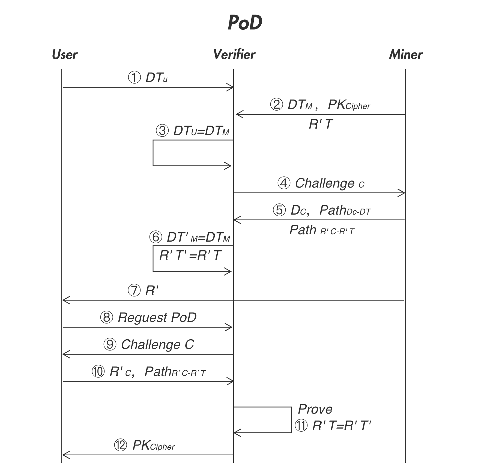
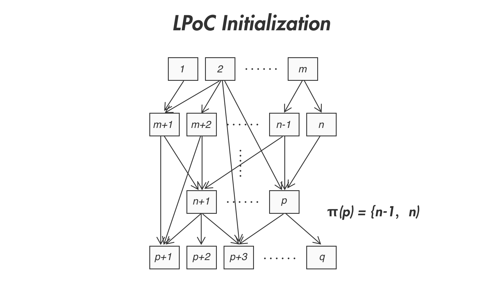
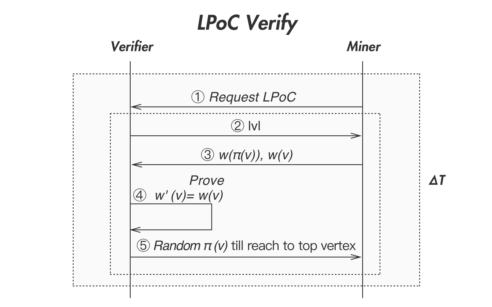
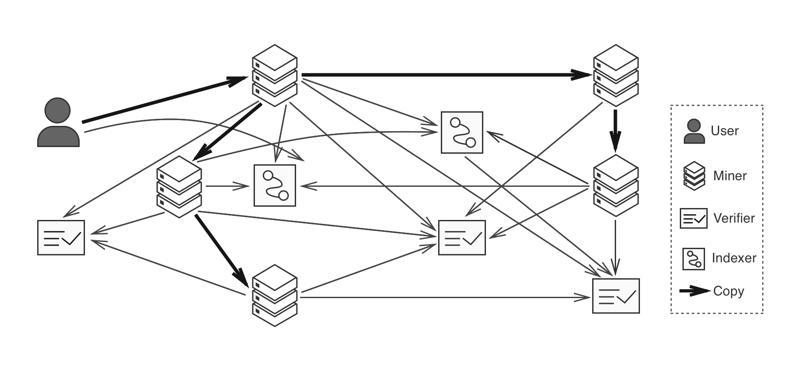
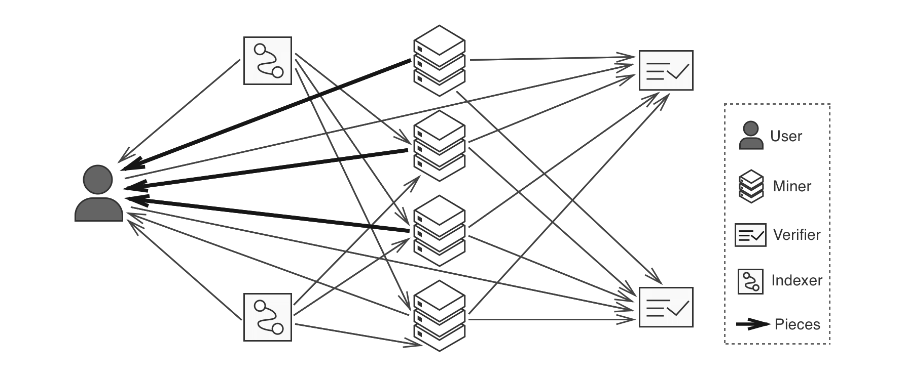
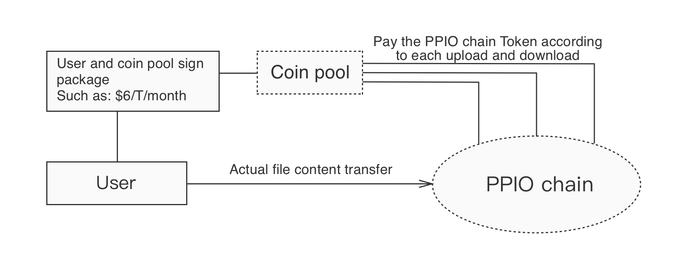

<p style="text-align: center;"><h1>PPIO: A Programmable P2P Storage and Delivery Network </h1></p>

<!-- TOC -->

- [1. Abstract](#1-abstract)
- [2. Introduction](#2-introduction)
- [3. Solution](#3-solution)
    - [3.1. Technology Highlights](#31-technology-highlights)
    - [3.2. P2P Network](#32-p2p-network)
        - [3.2.1. Data-Driven Scheduling](#321-data-driven-scheduling)
        - [3.2.2. Distributed Database and Routing](#322-distributed-database-and-routing)
        - [3.2.3. P2P Self-organizing Overlay networks](#323-p2p-self-organizing-overlay-networks)
        - [3.2.4. Optimized Distribution of Popular Content](#324-optimized-distribution-of-popular-content)
        - [3.2.5. ISP Friendly Scheduling](#325-isp-friendly-scheduling)
        - [3.2.6. PCDN](#326-pcdn)
    - [3.3. Proofs](#33-proofs)
        - [3.3.1. Proof-of-Replication (PoRep)](#331-proof-of-replication-porep)
        - [3.3.2. Proof-of-Download (PoD)](#332-proof-of-download-pod)
        - [3.3.3. Proof-of-Spacetime (PoSt)](#333-proof-of-spacetime-post)
        - [3.3.4. Light-Proof-of-Capacity (LPoC)](#334-light-proof-of-capacity-lpoc)
    - [3.4. Consensus](#34-consensus)
        - [3.4.1. Power of Miners](#341-power-of-miners)
        - [3.4.2. Verifiable Random Function (VRF)](#342-verifiable-random-function-vrf)
        - [3.4.3. Byzantine Fault Tolerance (BFT)](#343-byzantine-fault-tolerance-bft)
        - [3.4.4. PVFT Consensus](#344-pvft-consensus)
- [4. Architecture](#4-architecture)
    - [4.1. Physical Layer](#41-physical-layer)
    - [4.2. Data Layer](#42-data-layer)
    - [4.3. Network Layer](#43-network-layer)
    - [4.4. Consensus Layer](#44-consensus-layer)
    - [4.5. Incentive Layer](#45-incentive-layer)
    - [4.6. Interface Layer](#46-interface-layer)
    - [4.7. Application Layer](#47-application-layer)
- [5. Security](#5-security)
    - [5.1. Sybil Attacks](#51-sybil-attacks)
    - [5.2. Outsourcing Attacks](#52-outsourcing-attacks)
    - [5.3. Generation Attacks](#53-generation-attacks)
    - [5.4. Distributed Denial of Service Attacks](#54-distributed-denial-of-service-attacks)
    - [5.5. Eclipse Attacks](#55-eclipse-attacks)
- [6. Ecosystem](#6-ecosystem)
    - [6.1. Roles](#61-roles)
    - [6.2. Mining](#62-mining)
    - [6.3. Smart Contract](#63-smart-contract)
    - [6.4. Gas](#64-gas)
    - [6.5. Gas Price](#65-gas-price)
    - [6.6. Coin-Pool](#66-coin-pool)
- [7. Future](#7-future)
- [8. REFERENCES](#8-references)

<!-- /TOC -->

# 1. Abstract

PPIO is a programmable decentralized storage and delivery network. It not only provides more robust and efficient services than existing cloud-based storage platforms such as AWS S3 but also significantly reduces the storage cost. At the same time, PPIO offers better data security and privacy protection. PPIO's well-designed decentralized storage network and incentive mechanism allows it to make use of the vast amount of unused bandwidth and storage resources on the Internet, and provide reliable storage service at much lower cost. PPIO's unique decentralized file system prevents unauthorized access and ensures that all the data can be stored securely and privately. PPIO is designed from the ground up to perform efficiently on a global scale, by leveraging the founding team's experience from designing and running the decentralized network with hundreds of millions of users. PPIO meets the storage needs of both today's Internet businesses and services, and the emerging decentralized applications (DApps).

In this work, PPIO's design goals are explained, followed by the details on how it achieves these goals. It provides in-depth details on its distributed file system, network architecture, and storage workflow. It explains how PPIO can prevent various network attacks, and discusses how it establishes a healthy and sustainable incentive mechanism, economic model and ecosystem.

# 2. Introduction

The global cloud storage market has grown enormously in recent years and will continue to grow at a faster pace. However, the existing centralized solutions have many problems. Data breaching frequently occurs, with an ever-growing scale and impact. For example, the Dropbox hacking in 2016 alone leaked 68 million user accounts. These incidents pose a grave threat to not just the privacy of individual users, but also the security and integrity of the entire Internet. At the same time, high bandwidth and storage cost is another inherent problem of the centralized storage systems, it makes it extremely difficult for many Internet companies to be profitable.

There have been many attempts to build distributed storage systems. However, they were not successful. For example, Siacoin is built on top of Bitcoin-like Proof of Work (PoW) consensus. PoW introduces wasteful computation and energy consumption, and it does not take into account the different levels of storage and bandwidth contribution among the miners, which are crucial to a decentralized distributed storage system. Storj is another project that has gone through years of development, but it remains in the testing phase. Some of the known issues of Storj are the lack of quick response from miners upon storage request and its transactions are settled once per month which is not friendly to the miners. BurstCoin utilizes Proof of Capacity (PoC) that does take storage capacity of the miners into account, but unfortunately, it is not enough to serve well for the storage requirements.

The emerging FileCoin project that is under development by Protocol Labs adds an incentive layer on top of the Inter-planetary File System (IPFS), with the goal to build a storage infrastructure and protocol to replace HTTP protocol. For that purpose, its file index is made public to facilitate features like Web access, but it poses a challenge to preserving user privacy and data security in a storage network. Besides, some of its storage proofs are too complex and likely to hold the system back from running efficiently at a large scale. It does borrow mature P2P system designs from proven applications such as BitTorrent, but it provides no good solution to handle complex network environments and does not offer performance optimization within regional networks. Such deficiency in the design can lead to many real-world problems to the miners and ISPs. As Protocol Labs claims that files stored on IPFS are permanent and cannot be deleted, it runs the risks of facing legal battles against policies and regulations and makes its worldwide deployment much more difficult.

From the discussions above, it is clear that a complete decentralized storage solution is yet to be built to support large-scale and real-world storage use case, which is the goal PPIO attempts to accomplish. PPIO's founding team successfully designed, developed and maintained PPLive, a peer to peer streaming system that serves hundreds of millions of users on a daily basis. Such experiences allow the team to develop efficient and practical solutions and achieve the following design goals.

- **Low Storage Cost**. High storage cost is a critical challenge to Internet business. PPIO's well-designed incentives provide attractive financial rewards to miners and encourage them to contribute to the network. At the same time, it punishes misbehaving participants. As a result, a large, high-quality miner community can be established. This allows PPIO to make use of the vast amount of unused bandwidth and storage resources on the Internet, and provide robust storage service at much lower cost. To make the storage system easy to use, PPIO introduces a scheme called "Coin-Pool", that helps the users to easily manage store and download micropayments. At the same time, PPIO also introduces a mechanism to protect users from the impact of storage price fluctuations, which provides a better user experience than existing centralized storage platforms.

- **Scalability and High Efficiency**. Benefiting from the founding team's experience of creating and operating distributed network with hundreds of millions of users, PPIO is designed from the ground up to perform efficiently at a global scale. Besides a set of industry proven P2P transmission technologies, the team also developed data-driven scheduling, a self-organizing overlay network, and optimized content distribution. PPIO's design also improves the efficiency in regional networks and makes it more friendly to ISPs. Combined with its innovation in NAT Traversal, Kaldemlia distributed hash table (DHT), lightweight storage consensus proof and optimized transmission for media streaming, PPIO's distributed storage network can perform with extremely high efficiency and can be easily scaled to hundreds of millions of network nodes.

- **Privacy, Security and Stability**. Data security and privacy protection are the top requirements in PPIO's distributed file system design. By using data sharding and encryption algorithms, user's data can only be retrieved by the one who possesses the user's unique private key. At the same time, it allows the user to easily share their data to the public or within a private group. PPIO is equipped with practical storage proofs to maintain the integrity and reliability of its storage contents. Light Proof of Capacity (LPoC) is developed to provide efficent validation of storage capacity provided by the miners. An optimized Proof of Space-Time (PoSt) ensures that the specified data is indeed stored by the miner over specified period. Proof of Replication (PoRep) is used to guarantee that the miners replicate user's data. Proof of Download (PoD) ensures that user can download the stored data correctly.

- **Strong Application Support and Ecosystem**. PPIO provides a set of storage APIs similar to those of the cloud services such as AWS S3 and makes the data migration from those services much easier. PPIO also has a set of technologies built in to better support decentralized applications, including object-based storage, dApp Sandbox mechanisms, and file access management, etc. PPIO has a comprehensive plan to develop a robust, healthy and sustainable ecosystem, to facilitate the development of applications and services, and allow the developers to enjoy real benefits from PPIO's growth.


# 3. Solution

## 3.1. Technology Highlights

In this chapter, PPIO's solution will be elaborated in the following three core technical areas.

- **P2P Network**: PPIO constructs a self-governing, resilient and scalable P2P network that allows the participating nodes to easily share idle or unused bandwidth, storage, and computation resources. In the traditional Client-Server (CS) model, the server can quickly become the network bottleneck when the client population grows. However, a decentralized peer-to-peer network does not rely on any central server to function correctly, and can easily tolerate the fault and failure of some nodes. In such a network, multiple copies of the data are distributed and stored on many different nodes. It significantly improves the robustness of the distributed storage system and allows the client to download data from the closest neighbors on the network. Due to the unique nature of the P2P network, more copies of the data lead to faster download speed. In section 2 of this chapter, PPIO's P2P network design will be explained in details, including its intelligent data-driven scheduling algorithms, its implementation of the Distributed Hash Table (DHT), its traffic management based on Proactive Network Provider Participation (P4P), and its P2P based content distribution technology(PCDN).

- **Proof**: Network nodes in a traditional P2P network can join or leave the network at will, which makes it difficult to maintain the stability of the network. PPIO incentivizes the nodes based on their contribution in storage and bandwidth, so that they are more inclined to stay in the network and keep making contribution.[1] However, greedy, malicious nodes may attempt to cheat through various types of attacks, that undermines the system. Section 3 of this chapter explains PPIO's Proof of Replication (PoRep), Proof of Download (PoD), Proof of Spacetime (PoSt) [2][3], and Light Proof of Capacity (LPoC) that are designed to defend the network against all these attacks and maintain the integrity of the system. The optimized and secure implementation of the proofs allows them to function efficiently at large scale, that enables the incentive system to operate in a secure manner and helps establish a healthy storage market and economy.

- **Consensus**: Popular blockchain consensus algorithms such as Proof of Work (PoW), Proof of Stake (PoS) and Delegated Proof of Stake (DPoS) all make trade-offs in decentralization, security and performance. PPIO's consensus algorithm is designed by its use scenario. It calculates the power of the miners based on their storage and bandwidth contributions, selects a block producer randomly via Verifiable Random Function (VRF) [24][25], utilizes Byzantine Fault Tolerance (BFT) based consortium consensus for validation. It improves the efficiency of the network, protects its integrity and enables it to operate in a secure, decentralized manner. It is also the foundation of PPIO's high-volume, large-scale storage market.

## 3.2. P2P Network

PPIO's founding team developed PPLive and its innovative P2P network and data transmission technologies [4][5][6][7].   

**Facts about PPLive**:

- The world‘s only P2P data storage and transmission network that operates on more than 500 million nodes；

- 1/10 the operation cost of the traditional data network；

- 40PB storage combined P2P storage capacity.

By leveraging such experience, PPIO's P2P network is built into a robust, scalable and high-performing data storage and transmission system.


### 3.2.1. Data-Driven Scheduling

In PPIO‘s system, a storage "Object" is divided into "Segments", each "Segment" is further divided into some "Pieces". For example, one segment can be partitioned into M pieces, and these pieces can be duplicated and stored by N different storage miners. Each of these N miners is also called a “Peer”. A scheduler decides how the M pieces can be downloaded from the N peers so that the segment can be retrieved in a fast, efficient manner, and avoid duplicated pieces to be downloaded. This process is called **Multi-point Download Scheduling**.

Two data-driven scheduling algorithms are developed for the two use cases:

- File download
- Media streaming on demand [4]

**File Download**

Summary of the PPIO scheduling algorithm:

1. Multiple virtual connections (Tunnels) are established between the user and each peer with the resources, to improve transmission efficiency. UDP based protocols such as KCP or UDT [13] are attempted first to make the connection. If it fails, TCP based protocols will be used instead to adapt to different types of heterogeneous networks.
2. For each peer, an expected download speed $V_{conn}$ is calculated based on its transmission history. If no history is found, a default empirical value is used.
3. The number of virtual connections on each peer varies the peer with a higher $V_{conn}$ can have a significant number of initial virtual connections.
4. Based on the partition of the segment, the user first sends a download request to a given peer for an arbitrary piece, and the peer responds accordingly by sending the user the piece upon receiving the request.
5. When a piece is received from a virtual connection, the estimated download speed $V_{conn}$ is updated, and another remaining arbitrary piece will be requested from the connection immediately until all the data is downloaded.
6. When a download request times out, the request is canceled, and all connections to the non-responding peer will be closed. The download requests of the remaining pieces will be re-routed to other peers. In this case, the non-responding peer will also be penalized, and the number of connections that can be established from the peer in future downloads is reduced.  

Based on the experience of building the high-performing P2P network, PPIO's design allows multiple connections to be established from each peer. It significantly improves the overall transmission efficiency of the network, especially for TCP connections, as it works around the low-efficiency problem caused by TCP's conservative flow control.

**Real-time Data Streaming**

Besides supporting efficient file download, PPIO also supports optimized P2P data streaming. PPIO's data-driven scheduler is designed to provide stable real-time streaming performance in an ad-hoc P2P network[12]. The technology has gone through many iterations of trial-and-error optimizations and is proven to provide high-quality user experience to streaming applications such as video-on-demand (VOD) service.

A P2P streaming system has the following unique design characteristics:

- Sequential download. Subsequent segments and pieces from the current point of playback need to be prioritized in download scheduling, to maintain smooth streaming playback.

- Unpopular pieces. The unpopular pieces are the ones with the smallest number of duplicates in the network. In media streaming use case they need to be prioritized during download. This may seem counterintuitive, but prioritizing these pieces will help make downloading of the entire segment much faster and achieve better experience.

- Anchor points. Many media streaming applications allow random access playbacks such as fast forwarding or seeking. Anchor points are placed in the video stream to enable random access. The pieces at the anchor point are prioritized during download, to allow the playback to start immediately after random access.

To achieve the design requirements above, a scheduling algorithm is required to make smart decisions on which peer a piece should be downloaded from, how many peers should be used for simultaneous download, how to set up the timer for each peer, how to reschedule remaining pieces and adapt to network changes, etc. The scheduler is also designed to maximize download speed and minimize the overhead of duplicated requests and data transmission. A summary of the scheduling algorithm is as follows:

1. Similar to file download, multiple virtual connections (tunnels) are established with each peer, and the estimated transmission speed $V_{conn}$ is calculated per virtual connection.
2. Pieces to be downloaded are sorted based on their priorities and pre-allocated to available virtual connections by placing them in the corresponding download queues. The estimated arrival time for each piece can be calculated based on the speed of each virtual connection and the remaining pieces to be downloaded in each queue. In general, pieces with higher priority should end up with an earlier estimated arrival time. An illustration of the pre-allocation algorithm is shown in Figure 3.1.
3. Step 2 is repeated periodically, and all remaining pieces will be re-allocated to accommodate changes in the transmission speed and availability of the virtual connections.
4. After a piece is successfully downloaded, the transmission speed of the virtual connection is updated, and a request is sent immediately to download the next piece in the queue.  
5. Urgent pieces can be requested from multiple connections to ensure smooth playback.
6. Other parts of the algorithm work the same way as in regular file download.

- **Environment variables of the pre-allocation algorithm**  

```
// Definition of each virtual connection
struct PeerConn {
    speed := estimated speed of this virtual connection, in KB/s
    queue := virtual download queue of this connection
    isReq := is there pending request  
    lastReqTime := estimated arrival time of the last piece in queue, in ticks
}

pieceSize := size of the piece, in KB
nowTick := current time, in ticks
Peer[] conns := available connections
pieces := pieces sorted by priority
```

- **Pseudocode**


<p style="text-align: center;">Figure 3.1 Illustration of pre-allocation</p>

PPIO's P2P transmission network is fully dynamic. Each peer responds to multiple download requests, and potentially to multiple downloading nodes. Each downloading node sends download requests to multiple peers, manages downloaded pieces and deals with potential timeouts and failures from the peers. At the same time, the downloading node itself can be serving download requests, working as a peer to other nodes. By utilizing the two data-driven scheduling algorithms, PPIO's dynamic P2P network can handle an extremely high volume of concurrent data transmission efficiently.

### 3.2.2. Distributed Database and Routing

PPIO is a fully decentralized storage and distribution system that requires its database to be also managed in a decentralized fashion. PPIO employs Distributed Hash Table (DHT) to store data and provide routing and lookup services.

In a DHT, each piece of data is bundled with a unique key into a key-value pair. These key-value pairs are distributed and stored among the participating nodes. It avoids the problem with the centralized database system, where a failure in the central server leads to the breakdown of the entire network. No single participating node in the DHT is tasked to maintain the entire network. Each node only stores a small part of the database and only needs to maintain information of its adjacent nodes, such design significantly reduces each node’s bandwidth and resource usage. Redundancy is also added to the data and stored on multiple nodes to maintain the reliability of the system so that a single node failure does not cause loss of data.

There are many different implementations of DHT, some of the commonly used are Chord[14], Pastry[15], Tapestry[18], Dynamo[19], and Kademlia[16]. PPIO uses Kademlia, so do many other well-known P2P projects like PPLive, BitTorrent, eMule, etc.

Kademlia algorithm assigns a unique ID to each participating node. The node ID is also used to calculate the distance between nodes and locate key-value pairs. The algorithm steps through the network path and finds nodes closer to the key on every step to look up a specific key-value pair in the network until it reaches the node that stores the key-pair. Each node needs to store information of a group of other nodes based their distance to it to support the lookup. Such distance is calculated by taking an XOR operation on two Node IDs. Node IDs have the same bit length as the keys used in key-value pairs. Therefore, the distance between node IDs and keys can be calculated in the same way. Since the XOR distance does not take actual geographic distance into account, it is possible for two nodes to reside next to one another in the network even though one of them may be in the United Kingdom, while the other is in the United States.


<p style="text-align: center;">Fig 3.2 Lookup in Kademlia DHT</p>

PPIO also adopts an extension of Kademlia - S/Kademlia[23] to improve the security of the network. These changes are mainly caused by nodes via parallel looking over disjoint paths.  The network can sustain attacks even when a large number of nodes are compromised.

With the DHT implementation above, structured data such as file index, statistics on network nodes, and other metadata can be securely saved and quickly looked up in PPIO’s distributed network. However, data transfer in its storage network is handled differently, which will be discussed in the next section.

### 3.2.3. P2P Self-organizing Overlay networks

Today’s well-established storage services, such as Amazon S3, Dropbox, Google Drive, iCloud, etc., store customer data in large-scale data centers. Under cost constraints, each of the services can only deploy a limited number of data centers around the world. The deployment of Amazon AWS data centers is shown in Figure 3.3. Due to the ad hoc nature of the Internet, it is challenging to guarantee fast data transfer everywhere in the world by relying on a handful of data centers. Users in the same region have to compete for the available bandwidth from the data centers. As the number of users grows, their transfer speed and user experience will likely degrade.


<p style="text-align: center;">Figure 3.3 AWS global infrastructure</p>

PPIO’s distributed storage is a self-organizing, unstructured overlay network, that encourages connection among local peers. Nearby storage miners are more likely to be selected to store the data. Similarly, data distribution and retrieval are mostly handled by nearby peers as well. As a result, data transfer can be maintained at much higher speed by fully utilizing local network bandwidth.

With more nodes joining PPIO’s storage network, it becomes easier for each node to find nearby peers with a faster connection, for both storage and retrieval. Server bandwidth is no longer a bottleneck, and user growth leads to better speed and experience.

**Establishing a Self-Organizing P2P Network**

Every node in PPIO’s network maintains a list of neighboring peers to stay connected with. The list gets continuously updated by dropping disappeared nodes and adding newly joined neighbors. As a result, the list should mostly contain active and fast neighbors. With all the nodes following the same process as described below, the self-organizing P2P overlay network can be established and maintained.

- Start by selecting an initial set of candidate neighbors among the peers with which it had connections in the past. Newly joined nodes start with an empty list.
- Obtain new candidate neighbors from the Kademlia DHT. As discussed in the previous section, there is no guarantee that these peers are its geographical neighbors or have a fast connection to the node.
- Attempt to make connections to the above two sets of candidate nodes, the number of connections cannot exceed a given limit. Each of the connected nodes is now considered a neighbor.
- Obtain new candidates repeatedly, by looking up neighbor's neighbors.
- Probe and evaluate the transmission speed of each new candidate repeatedly, in a round robin fashion, rank the candidates based on the evaluation.
- Eliminate neighbors that have the low-speed connection to the node or are no longer reachable.
- Select candidates ranked at the top to replace eliminated neighbors.
- Repeat the entire process.

Each node needs to maintain two real-time lists to support the above process, a list of current neighbors, and a list of neighbor candidates. Besides, each node also maintains a list of past neighbors. These are essential to node selection in the overlay network.

**Preferred storage miners with a closer network distance**

When user uploads data to PPIO's storage network, its neighbors with a closer network distance are prioritized when selecting storage miners to store the data. A large percentage of the copies of the data are stored on the neighboring miners with a faster connection to the user, to achieve higher transfer speed during storage and retrieval. When enough miner nodes join the network in different regions of the world, high data transfer speed can be maintained around the globe.

**About users who change regions frequently**

When a user node repeatedly travels between two different regions, PPIO’s design can provide a great user experience in both places. When the user node is in location $A$, it finds neighbors in location $A$. When the user node is in a second location $B$, it finds neighbors in location $B$. As a result, its neighbor list or history list contains peers from both locations. If the user node stays in location $A$ for an extended period, its neighbor list will contain more peers from location $A$, and vice versa. If the user node repeatedly travels back and forth, the list will contain the similar number of peers from location $A$ and $B$. In this way, when user node uploads data, neighbor miners from both nodes will store copies of the data, so that fast data retrieval can be achieved in both places.

**If the user permanently relocates to a different region**

When a user node permanently relocates to a different region, PPIO provides a reset feature to help with the reschedule. When the reset is initiated, its neighbor list is rebuilt from scratch. New copies are created for existing user data in the network, and these copies are stored by prioritizing the new neighbors. In this way, fast data retrieval can be achieved for previously stored data, as well as new data to be stored to the network.  

### 3.2.4. Optimized Distribution of Popular Content

In a data distribution network, a small number of popular content can consume a large portion of the bandwidth and storage resources. At the same time, the download speed of popular content can have a considerable impact on the overall user experience. Therefore, optimization of popular content distribution is crucial to the network. PPIO provides two optimized scheduling methods for popular content, one is storage miners active selection, and the other is enforced by the scheduler(indexer node). The two methods are designed to work together and ensure the efficient distribution of popular content and maintain a healthy ecosystem of the storage network.

**Storage miners active selection**

As described in section 3.2.3, a self-organizing overlay network is established by the participating nodes. When a user node requests for a piece of data, it looks up the resources from the indexer node, and the indexer node returns information about the miner nodes that store the content. At the same time, user node also broadcasts the request to its neighbors to find the resources. Its peers will forward the request to their neighbors upon receiving it. To avoid unnecessary burden on the network, the length of the forwarding path is limited. But it also adapts based on the number of nodes that the request has reached. When not enough nodes have been reached, a longer forwarding path is allowed.   

When a miner node receives the forwarded request, and if it happens to possess the requested resources, it notifies the user and there is better priority that user will ,in fact, download the data from it, since the miner node is in the forwarding path of the user’s neighbors, and thus close to the user. In PPIO, the miner is incentivized to provide download service as it gets rewarded for doing so.  

From the process above, a miner can track the requests of nearby users and identify popular content. As storing popular content increases its chance to provide download service and get rewarded, the miner will proactively send requests to the scheduler to store the resources of popular content. As many miners follow the same strategy, popular data gets quickly populated, and it improves the download speed significantly for the users. When a miner discovers that its stored content is no longer trendy, it can request to remove the content from its storage. Once approved, the storage can be released and made available to store other resources.

This method is driven by the demand, and it incentivizes miners to store popular content proactively. It also adapts to the popularity of data in different regions. As PPIO’s overlay network is built by clustering nearby peers, if a piece of content is only popular in a certain region, only the miners in the same region populate it extensively. Miners in other parts of the network are not affected. Thus the overall efficiency of the storage network is maintained.

The algorithm to identify popular content can be customized by each miner. Different miners in different regions can customize the algorithm differently, to optimize for higher reward.

**Enforced by the indexer**

The miner nodes that store a large amount of popular content are likely to receive more download requests, and fulfilling those requests gets them higher rewards. However, too many concurrent downloads will exhaust the bandwidth resource of these miners and reduce the download speed of each user. At the same time, it is not fair to the miners that store less popular content, that gets much lower reward than the others.  

To avoid these problems, the scheduler(indexer) in the network employs an adjusted scheduling service based on the popularity of the content. The miners that request to store the most popular content need to pay the scheduler(indexer) before receiving the resources. The miner nodes with higher bandwidth and larger storage still have enough incentives to do so, but they won’t download too much such content. Otherwise, they can no longer achieve a surplus by providing download service that their bandwidth allows them to.  


<p style="text-align: center;">Figure 3.3 Dispatch of Popular Content </p>

As shown in Fig 3.3, multiple miners store copies of the same data, they need to compete to provide download services to the user. The user always prefers the ones that provide higher download speed. If a miner does not have enough bandwidth, users will switch to others. The amount of data it uploads to the users will decrease, which in turn decreases the reward it receives. Therefore, the miners with lower bandwidth will not be incentivized to store popular content. As a result, popular contents are mostly stored on the miners with higher bandwidth, which in turn improves the speed and experience when the user downloads such content.

### 3.2.5. ISP Friendly Scheduling

In most P2P networks, a node can transfer data with any other peers, regardless of their location. As a result, a single data transfer can potentially create traffic anywhere in the world and consumes bandwidth between different Internet Service Providers (ISP), or even between different countries. In 2007, a research institute iPoque carried out an analysis on nearly 3TB of anonymous data sampled from more than a million internet users in Eastern Europe, Southern Europe, Australia, and the Middle East. [26] Their studies show that P2P file sharing takes up a significant part of the network bandwidth consumption, accounting for about 49% in the Middle East, and 84% in Eastern Europe. From a global perspective, 95% of the bandwidth at prime time is involved in some forms of P2P data transmission. In recent years, the percentage of P2P traffic has dropped due to a shift in the use pattern of Internet applications. However, with the recent development of blockchain technology and decentralized applications, P2P network traffic is expected to start increasing again. P2P traffic consumes an extraordinary amount of network bandwidth, including international bandwidth. It puts a lot of burden on our internet infrastructure, and significantly increase the cost for ISPs to operate.

As described in section 3.2.3, PPIO’s self-organizing overlay network encourages data transfer among neighboring nodes, a large percentage of its traffic is contained within the local network, and the operation cost incurred upon ISPs is significantly reduced. However, the  topology of PPIO’s overlay network may not match the ISP topology exactly. Further optimization to reduce unnecessary traffic between ISPs is needed to improve further PPIO’s ability to scale globally.

If the nodes participating in a data transmission happen to be in the close vicinity of each other, it is likely that the traffic will be contained within their area network. As a result, the bandwidth cost will be significantly reduced. This is the principle behind P4P, to fully utilize local network bandwidth in a P2P network.  

P4P, or Proactive network Provider Participation for P2P [17], is a method for ISPs and P2P software to optimize connections []. It enables peer selection based on the topology of the physical network, to reduce traffic on the backbone network, lower the operation cost of network providers, and improve data transfer efficiency. 

The implementation of P4P in traditional P2P networks relies on central servers. As PPIO is a completely decentralized network, a decentralized P4P solution is required.

PPIO provides an iP4P interface that allows ISPs to set up and configure P4P in their network and allows applications to query the information. iP4P is designed to be similar to the iTracker interface[17] in centralized P2P networks, to make it easier to adapt.

- `ip-list`: allows ISPs to provide the list of IPs in their network, it allows nodes in PPIO’s network to be associated with their ISP.
- `policy` allows ISPs to configure the policy for applications to access P4P information.
- `p4p-distance` allows applications to query P4P cost and distance between network nodes.
- `capability` allows applications to query of network resources and capacity of the ISP network.
- `friendly-isp-list` allows applications to query information of friendly ISP, including p4p-distance across different ISPs.

At the same time, PPIO introduces a global IP database that is maintained by the community. Information in the database can be used to calculate the p4p distance between two nodes in the network when at least one of them is not within a known ISP network from the iP4P Interface. The database is synced to scheduler(Indexer) nodes and Verifier nodes in the P2P network. Every node in the network can query its information from the database. The following shows part of the information stored for each node.

```protobuf
message P4PPeerInfo {
    uint32 countryId = 1;   //  Country ID
    uint32 ispId = 2;       //  ISP ID
    uint32 stateId = 3;     // State or Province ID
    uint32 cityId = 4;      // City ID
}
```

When selecting data connections from a given node, the indexing and scheduling node (Indexer) in PPIO’s network checks whether the node can be queried from the iP4P interface:  

- If so, a peer lookup in the node’s ISP network will be conducted first, followed by a lookup in the friendly ISPs, and finally among all other peers. The final peer decision will still be decided based on connection speed as described in 3.2.3. In this way, peers with shorter p4p distances to the node are more likely to be selected to upload or download its data. At the same time, nodes in slower ISPs can still connect to faster outside peers. As a result, unnecessary traffic between different network providers is significantly reduced, and user experience across the entire network is maintained at a high-level.

- If not, the p4p distance calculated from the global IP database is used in the pre-selection of peers. Similarly, the final selection will still be based connection speed.


### 3.2.6. PCDN

PCDN stands for CDN acceleration with P2P, and it utilizes the abundant bandwidth and storage resources of miners in the P2P network to achieve faster data distribution. PPIO is designed to support PCDN and provide an easy-to-use interface to DApps to accelerate their content delivery.

It is published on the source node first to start distributing a piece of content. As long as the source node is online, the user can download them from it. However, as the number of users downloading from the same source node increases, its available bandwidth gets quickly exhausted, and the downloads will slow down. With PCDN, when other miner nodes start to store and provide download services for the same piece of content, users will be able to download from multiple peers in the network and enjoy much better user experience.


<p style="text-align: center;">Figure 3.5 PCDN Data Flow</p>

There are two ways for applications to implement PCDN in PPIO.

1. Take advantage of content scheduling described in 3.2.4.  As PPIO embeds optimized scheduling of popular contents in its overlay network,  the miners will proactively download and store these data, and provide download services. As a result, data gets copied and distributed across the network where the data is deemed popular. It improves download experience as the number of copies increase.

2. Enable and configure PCDN directly. PPIO provides a set of APIs to allow DApps to set up PCDN for their content. The applications can specify the number of copies to be maintained in specific parts of the network, or specific geographic location regarding the country, ISP, state and city, as defined in the P4P database. PPIO will find the miner nodes in the specified area to store the copies and provide download services. As the scheduling is specified by the application, it needs to compensate the miners’ cost in storage spacetime, scheduling and conducting storage proofs. Figure 3.5 shows the PCDN-driven data flow in the network in this case.


## 3.3. Proofs

PPIO employs 4 different storage proofs, namely Proof of Replication (PoRep), Proof of Download (PoD), Proof of Spacetime (PoSt) and Light Proof of Capacity (LPoC). These proofs guarantee that the storage provider (miner) correctly replicates the data and consistently stores the data within the agreed period. They also ensure that user can successfully download the data any time during the agreed term. These proofs maintain the integrity and reliability of PPIO's storage system. They will be discussed in details in this section.

Definition of terms in the section:

- CRH: Collision-Resistant Hashing, a hash function h with which it is very tough to find two different inputs x, x', and generate the same output h(x) == h(x').

- MerkleCRH: The root hash of a Merkle tree built from collision resistant hashing. Merkle tree can be used as an efficient way to validate if the content of a data block matches the original data.

- Seal: An encryption method to ensure that each copy of the data has a unique and independent representation. The encryption process should take substantially longer time than decryption, to prevent Generation Attacks. AES-256 is a viable option for its implementation.

- Cipher: A lightweight encryption method with symmetric keys, used in Proof-of-Download. XOR Cipher is a viable option for its implementation.  

### 3.3.1. Proof-of-Replication (PoRep)

Proof of Replication (PoRep) provides a way to verify that Miner $L$ correctly replicates Data $D$ from User $U$ and stores it in its storage. The process also provides an indirect proof of the bandwidth available to $L$. The procedure of PoRep is described below.


<p style="text-align: center;">Figure 3.6 Proof-of-Replication</p>

1. User $U$ generates a Seal key $PK_{Seal}$, applies it to encrypt Data $D$, and generates a unique copy $R=Seal(D, PK_{Seal})$. It also builds a Merkle Tree on top of $R$, calculates the root hash of the tree $RT=MerkleCRH(R)$, and sends $RT$ to Verifier $V$.
2. $U$ transmits $R$ and $PK_{Seal}$ to miner $L$.
3. $L$ requests PoRep challenge from $V$, $V$ accepts the request and sends a random challenge $c$ to $L$, i.e. it challenges the storage of the $c$th data block of $R$.
4. $L$ retrieves $R_{c}$ which is the $c$th block of $R$, and calculates $Path_{RC-RT}$ which contains the hash values of all the Merkle tree nodes path from the $R_{c}$ to the root node. $L$ returns the following to $V$:
    - $R_{c}$
    - $Path_{RC-RT}$
5. From received $R_{c}$ and $Path_{RC-RT}$, $V$ generates the Merkle tree root hash $RT'$, if $RT'$ matches the original root hash received from $U$, i.e. $RT' == RT$, the proof has succeeded, otherwise the proof has failed.  

### 3.3.2. Proof-of-Download (PoD)

Proof-of-Download (PoD) provides a way to verify that Data $D$ has been correctly downloaded from the Miner $L$ to User $U$. The procedure of PoD is described below.



<p style="text-align: center;">Fig3.7 Proof of Download</p>

1. For Data $D$ to be downloaded, User $U$ sends the root hash of its Merkle tree $DT_{U}=MerkleCRH(D)$ to Verifier $V$.
2. The miner $L$ decrypts its stored copy $R$ and obtains data $D$. It then calculates the root hash of its Merkle tree $DT_{L}=MerkleCRH(D)$.
3. $L$ creates a Cipher Key $PK_{Cipher}$, applies it to Data $D$, and generates a ciphered copy $R'=Cipher(D, PK_{Cipher})$. It then calculates the root hash $R'T=MerkleCRH(R')$, and sends the following to $V$:
    - $DT_{L}$
    - $PK_{Cipher}$
    - $R'T$
4. $V$ checks whether $DT_{U}$ is identical to $DT_{L}$. If not, the proof has failed.
5. $V$ sends a random challenge $c$ to $L$, i.e. the storage challenge of the $c$th block of $D$ and $R'$.
6. $L$ retrieves $D_{c}$ which is the $c$th block of $D$ and calculates $Path_{DC-DT}$ which contains the hash values of all the Merkle tree nodes path from the $D_{c}$ to the root node. $L$ also retrieves $R'_{c}$ which is the $c$th block of $R'$ and calculates $Path_{R'C-R'T}$ which contains the hash values of all the Merkle tree nodes path from the $R'_{c}$ to the root node. It then returns the following to $V$:
    - $D_{c}$
    - $Path_{DC-DT}$
    - $Path_{R'C-R'T}$
7. From received $D_{c}$ and $Path_{DC-DT}$, $V$ generates the Merkle tree root hash $DT'_{L}$, and verifies that $DT'_{L}$ matches the root hash $DT_{L}$ previously received from $L$, i.e. $DT'_{L} == DT_{L}$. If not, the proof has failed.
8. From received $D_{c}$ and $PK_{Cipher}$, $V$ generates ciphered data block $R'_{c}=Cipher(D_{c}, PK_{Cipher})$, and calculates the root hash $R'T'$ using $R'_{c}$ and received $Path_{R'C-R'T}$, and verifies that $R'T'$ matches the root hash previously received $R'T$ from $L$, i.e. $R'T' == R'T$. If not, the proof has failed.
9. $U$ downloads data $R'$ from $L$.
10. $U$ requests proof of download from $V$
11. $V$ sends a random challenge $c$ to $U$, i.e. the storage challenge of the $c$th block of $R'$.
12. $U$ retrieves $R'{c}$ which is the ${c}$th block of content on $R'$, and calculates $Path{R'C-R'T}$, which contains the hash values of all the Merkle tree nodes path from the $R'_{c}$ to the root node, and sends following to $V$:
    - $R'_{c}$
    - $Path_{R'C-R'T}$
13. From received $R'_{c}$ and $Path_{R'C-R'T}$, $V$ generates the Merkle tree root hash $R'T"$, if $R'T"$ matches the root hash $R'T$ previously received from $L$, i.e. $R'T" == R'T$, the proof has succeeded, and $V$ sends the Cipher key $PK_{Cipher}$ to $U$, so that $U$ can decipher $R'$ to recover data $D$ successfully.

### 3.3.3. Proof-of-Spacetime (PoSt)

Proof of Spacetime (PoSt) provides a way to verify that Miner $L$ has stored Data $D$ for a given period. The process also provides an indirect proof of the storage capacity of $L$. The procedure of PoSt is described below.


<p style="text-align: center;">Fig 3.8 Proof of Spacetime</p>

1. As described in PoRep procedures, data $D$ is encrypted to obtain a unique copy $R$, $R$ is stored on $L$, its Merkle tree root hash is $RT=MerkleCRH(R)$.
2. $V$ also stores $RT$.
3. At a given time $T$, $L$ requests proof of storage challenge from $V$.
4. $V$ sends a random challenge $c$ to $L$, i.e. the storage challenge on $c$th block of $R$.
5. $L$ retrieves $R_{c}$ which is the $c$th block of $R$, and calculates $Path_{RC-RT}$ which contains the hash values of all the Merkle tree nodes path from the $R_{c}$ and the root node, and sends the following to $V$:
    - $R_{c}$
    - $Path_{RC-RT}$
6. From received $R_{c}$ and $Path_{RC-RT}$, $V$ generates the Merkle tree root hash $RT'$, and verifies that $RT'$ matches the original root hash stored $RT$, i.e. $RT' == RT$. If not, the proof has failed.
7. Repeat steps 3 to 6 at given time intervals.
8. The series of repeated successful challenges and proofs between $L$ and $V$ generates the successful proof of spacetime.

### 3.3.4. Light-Proof-of-Capacity (LPoC)

Light Proof of Capacity (LPoC) provides a way to verify the available storage capacity of miner $L$. The available capacity does not include the storage space already used for existing data. PPIO's lightweight proof reduces the number of resources wasted on conducting complicated proofs. The procedure of LPoC is broken into two phases, which are described below.

- **Initialization Phase**


<p style="text-align: center;">Fig 3.9 Initialization Phase of Light-Proof-of-Capacity</p>

1. $V$ generates a unique Directed Acyclic Graph (DAG) $G=(N, E)$ for a specific miner $L$, in which N is the set of nodes in G, and E is the set of edges that connect different nodes in G.
2. Let $\pi(n)=\{n':(n',n)\in E|n'\in N, n\in N\}$ be the set of predecessors of node $n$ in $G$.
3. Let $L_{ID}$ be the identifier of $L$, let $|n|$ be the identifier of node $n$.
4. Let $w(n)=CRH(L_{ID}, |n|, w(\pi(n))$ be the hash value of node $n$, in which $w(\pi(n))=(w(n_{1}),...,w(n_{M}))$ and $n_{1},...n_{M} \in \pi(n)$；
5. $L$ calculates the hash value $w(n)$ for all the nodes in $G$, and stores the values in its available storage, to prepare for challenges from $V$.

- **Verification Phase**


<p style="text-align: center;">Fig 3.10 Verification Phase of Light-Proof-of-Capacity</p>

1. At a given time $T$, $L$ requests LPoC challenge from $V$.
2. $V$ choose a random node $n \in N$, and sends $|n|$ to $L$.
3. Based on received $|n|$, $L$ sends its stored hash values $w(\pi(n))$ of all the nodes in $\pi(n)$ and stored $w(n)$ to $V$
4. From received $w(\pi(n))$, $V$ calculates $w'(n)$ by the formula $w(n)=CHR(L_{ID}, and |n|, w(\pi(n))$, and verifies that $w'(n)$ is identical to previously received $w(n)$ from $L$. If not, the proof has failed.
5. $V$ randomly chooses one of the predecessors of $n$, repeats steps 2 to 4, until there is no more predecessors to try in any of the predecessor sets.
6. Repeat the procedure from step 1 at given time intervals.
7. The series of repeated successful challenges and proofs between $L$ and $V$ generates the successful proof of capacity for $L$.

## 3.4. Consensus  

For a decentralized blockchain network to operate, different nodes need to reach consensus to verify and record transactions in the network. It is also a required process when adding new blocks to a blockchain’s ledger. PPIO’s storage market is based on blockchain technology. It also requires a consensus mechanism explicitly designed for its storage network, to maintain a secure and healthy storage market. Commonly used consensus algorithms have their pros and cons. The Proof of Work (PoW) consensus forces each node to solve a complicated math problem, to compete to build new blocks. PoW is reliable, but it introduces meaningless computation and waste of energy. The Proof of Stake (PoS) consensus weights the nodes based on how many cryptocurrencies they hold, in deciding which node has the right to build new blocks. It enables much faster block building and alleviates the wastefulness problem in PoW, but it still runs the risk of becoming centralized, as the most prominent stakeholders are likely to dominate and become monopolies. FileCoin introduces Proof of Spacetime and uses it as a measure to calculate the power of each node in its consensus algorithm. It is a combination of the ideas behind PoW and PoS. However, using proof of spacetime alone does not adequately represent the contribution of each node. For example, certain nodes may not have a large storage capacity, but can still provide valuable download services with their high bandwidth connections, which should also be counted as the contribution to the network.

PPIO’s consensus algorithm takes both storage and bandwidth contribution of each miner node into account when calculating its power. The process starts by generating a pool of candidate miner nodes based on the power of each node, and from the pool, a random miner is selected via Verifiable Random Function (VRF) to build a new block. Finally, the block is validated via Byzantine Fault Tolerance (BFT) consensus. This method can improve the speed and reduce the cost of block building, prevent nodes from becoming monopolies, and maintain the consistency and security of the ledger.

### 3.4.1. Power of Miners

The voting power of each node in PPIO’s network is calculated based on two factors:

- **Power of Storage**: The power of storage for miner $L_{i}$ at a given time $t$ is calculated as: $L^{i,t}_{s} = \alpha * L^{i,t}_{st} / N_{st} + \beta * L^{i,t}_{c} / N_{c}$, where $L^{i,t}_{st}$ is the proven storage spacetime of miner $L_{i}$ at time $t$,  $L^{i,t}_{c}$ is its proven capacity at time $t$,  $N_{st}$ is the total proven spacetime of the entire network, and $N_{c}$ is the total proven capacity of the entire network. The calculation takes into account both the current storage spacetime and the remaining capacity of the miner so that it evaluates not only the miner’s current contribution but also its potential contribution in the future. The parameters $\alpha$ and $\beta$ can be used to adjust the balance between the two factors at the different development stages, to provide enough incentives for new miners to join and contribute resources. For example, during the early stage of the network when there is not enough data to be stored, larger $\beta$ and smaller $\alpha$ values can be used. As storage usage increases, the value of $\beta$ will be gradually decreased while the value of $\alpha$ will be gradually increased.

- **Power of bandwidth**: The power of bandwidth for miner $L_{i}$ at a given time $t$ is calculated as: $L^{i,t}_{b} = \gamma * L^{i,t}_{bw} / N_{bw}$, where $L^{i,t}_{bw}$ is the proven bandwidth of miner $L_{i}$ at a given time $t$, and $N_{bw}$ is the total proven bandwidth of the network.

By combining the power of storage and the power of bandwidth, the overall power of miner $L_{i}$ at time $t$ can be calculated as: $L^{i,t}_{pow} = L^{i,t}_{s} + L^{i,t}_{b}$.

The next step is to apply the overall power of each node in selecting the candidates to build the next block. At time $t$, let $B_{prev}$ be the previous block in the ledger, let $M$ be the maximal value of the $Hash$ function, let $D$ be the difficulty parameter, the miners that satisfy the following condition will be selected as candidates:  $Hash(Hash(B_{prev}), L_{i}) \leq L^{i,t}_{pow}\*M/D$

From the equation it is clear that the chance of a miner getting selected depends on its overall power at the time $L^{i,t}_{pow}$, that represents its overall contribution to the network. Higher power leads to higher chances of being selected. 


### 3.4.2. Verifiable Random Function (VRF)

After the selection in 3.4.1 is complete, all the candidate miners are placed in a pool, ready for the next stage of selection. PPIO injects randomness at this step to avoid the monopoly by a small number of miners. However, in a decentralized network, randomness itself needs to be verified. Therefore PPIO adopts Verifiable Random Function (VRF) [20] in the calculation to decide which candidate miner has the final right to write a block.

VRF is a pseudo-random function that provides publicly verifiable proofs of its outputs' correctness[24], its mathematical definition [25] is:

- $Function$ $F$

- $GEN\left(1^k\right)=generates\left(PK, SK\right)$

- $PROVE_{SK}(x)=(F_{SK}(x), \Pi_{SK}(x))$

- $VER_{PK}(x, y, \Pi)= true \mathbin{/} false$

Function $GEN$ generates a public key $PK$ and a private key $SK$. Apply VRF $F$ with $PK$ on input $x$ to get $y=F_{SK}(x)$ and proof $\Pi_{SK}(x)$. $y$ is the generated random number, and it can be verified using the public key $PK$ by $VER_{PK}(x, y, \Pi)= true \mathbin{/} false$.

VRF has the following characteristics:

- **Uniqueness**

  - $\nexists((x, y_{1}, \Pi_{1}), (x, y_{2}, \Pi_{2}))$ s.t. $VER_{PK}(x, y_{1}, \Pi_{1})=VER_{PK}(x, y_{2}, \Pi_{2})$

- **Provability**

  - if $(y, \Pi)=PROVE_{SK}(x)$ then $VER_{PK}(x, y, \Pi)= true$

### 3.4.3. Byzantine Fault Tolerance (BFT)

Byzantine Fault Tolerance(BFT) is originated from the Byzantine Generals' Problem, which is a famous example of distributed consensus. [21] In a distributed network, different nodes reach consensus by exchanging information. However, some messages may contain incorrect or confusing information due to node failure, or message corruption during transmission. It's also possible that certain nodes are malicious or compromised and attack the network deliberately. As a result, the consistent consensus cannot be easily achieved.  The goal of BFT is to solve these problems.


### 3.4.4. PVFT Consensus

PPIO combines node selection based on power, randomized block building based on VRF and fault tolerance based on BFT into a unique consensus algorithm called PVFT, and its mathematical form is defined as follows:

- $G_{bp}={bp_{1}, bp_{2},...bp_{n}|stake(bp_{i})\geqslant C}$ The power of each candidate node in the candidate pool $G_{bp}$ needs to be higher or equal to a minimal value C.

- $(F_{SK}(Block_{prev}), \Pi_{SK}(x)),BP=F_{SK}(Block_{prev}) \mod |G_{bp}|$. Find a random number by applying VRF to the hash of the previous block, then calculate its modulo over the size of the candidate group $G_{bp}$, and use the result to select the node to build the next block.

- $BFT(G_{bp})$ Candidate nodes validate the new block being added and reach the final confirmation.

# 4. Architecture

PPIO follows a layered system design, to facilitate future expansion, and make it more friendly to developers. As shown in Figure 4.1, PPIO consists of seven layers, which are:


<p style="text-align: center;">Figure 4.1 The 7 layer architecture of PPIO</p>

1. Physical Layer: the hardware layer, that provides underlying storage and bandwidth resources, discussed in 4.1.

2. Data Layer: basic data units and structures, discussed in 4.2.

3. Network Layer: P2P network protocol and algorithms for connection, data transfer, load balancing and encryption, discussed in 4.3.

4. Consensus Layer: PPIO’s consensus scheme and its implementation, discussed in 4.4

5. Incentive Layer: manages incentives and rewards based on the role of each node in the network, discussed in 4.5

6. Interface Layer: SDK and APIs for the developers and to support the application layer, discussed in 4.6

7. Application Layer: Apps or DApps developed by the 3rd party developers, discussed in 4.7


## 4.1. Physical Layer
Disk storage and network bandwidth are the core components of PPIO’s physical layer. They are the essential resources in PPIO’s storage network and therefore are also the basis in evaluating each storage miner’s contribution to the network. The miners with large storage capacity but limited bandwidth can contribute more in providing storage service, while with less storage but higher bandwidth can contribute more in providing bandwidth service. The miners with abundant storage and high bandwidth contribute to the network the most and in turn, get rewarded the most.

- **Storage**: Physical storage may consist of Flash drive, Solid State Drive (SSD), Hard Disk Drive (HDD), Tape and Optical Disc (OD). In PPIO’s storage network, different types of storage can play different roles based on their characteristics. For example, SSD can be used to store and provide fast retrieval service for popular content. The lifespan of the storage media also needs to accommodate the length of the storage contract, for example, tape and optical disk can be used for long time storage while SSD and Flash can cover short-term storage uses.

- **Network bandwidth**: In bit/per second, network bandwidth measures the maximum rate of data transfer across a given network path. Network transmission media can include coaxial cable, twisted pair cable, optical fiber cable, and wireless connection. Their bandwidth varies a lot, from Kilobits and Megabits per second to Gigabits per second. Network service can be categorized into business and residential networks, and they have very different characteristics in bandwidth usage. For example, the use of business bandwidth is usually high during the day, while the use of residential bandwidth stays low. The opposite happens during night time and weekends. PPIO’s distributed storage network adapts to these dynamics to make efficient use of the available bandwidth in the network.


## 4.2. Data Layer
he next above the physical layer is the data layer. As shown in Figure 4.2, there are three types of data structures used in PPIO’s storage network:


<p style="text-align: center;">Figure 4.2  The data structures in the data layer</p>

- **Plot/Tile: the storage capacity unit**

  - The Plot can be considered as a virtual drive in PPIO’s storage network, and it is initialized when the miner joins the network. Without any data stored, it's the basic unit used in capacity proof - LPoC (as described in section 3.3.4). With data stored, it is the base unit of spacetime proof - PoSt (as described in section 3.3.3).

  - Tile is the smallest unit of verifiable storage in the plot. Its size is 128KB. In PoRep, PoD, and PoSt, Tile is used as the basic unit in the verification.

- **Segment: the storage data unit**

  - The segment is the base unit of PPIO’s object-oriented storage. A storage object is always divided into multiple segments. To improve privacy protection, PPIO prevents any miner node from storing all the segments of an object copy, even if the copy of the object is encrypted. A segment is also the smallest unit in storage scheduling, and its size ranges from 128KB to 16MB.

- **Piece: the data transmission unit**

  - A piece is the smallest data unit in PPIO’s network transmission, with the size of 128KB.

Data redundancy is required to maintain reliable data storage. PPIO adopts two methods to add redundancy to its stored data.

- **Data Copies**: The original data is replicated into more copies. Although the method introduces large storage overhead, its computation complexity is low, and the original data can be quickly recovered. It can often be used in storing popular content.

- **Redundant Coding**: Divide the original data into blocks and encode them with Erasure Code to generate a group of new data blocks that have redundancy embedded. The original data can be recovered if no more than a certain number of the data blocks are lost or corrupted. This method has much lower storage overhead, but it is more computationally intensive. It can often be used in storing immutable or less popular content. Reed Solomon[22] is one of the commonly used Erase Code, and can be explained as follows:

  - Let $n$ be the number of data blocks in the original data, and $m$ be the number of redundant data blocks, the original data blocks can be denoted as $D_{n \times 1}$.
  - Define a Distribution Matrix as $B_{(n+m) \times n}$, in which the first n rows and n columns form an identity matrix, and the remaining m rows and n columns are called Vandermonde Matrix or Cauchy Matrix.
  - Encoding: Encode $D_{n \times 1}$ and generate the new set of data blocks $DC_{(n+m) \times 1}$, $B_{(n+m) \times n} \times D_{n \times 1} = DC_{(n+m) \times 1}$;
  - Verification: Decode data blocks $B^{-1}_{n \times (n+m)} \times DC_{(n+m) \times 1} = D'_{n \times 1}$. If $D'_{n \times 1}==DC'_{n \times 1}$ data is correctly decoded, otherwise data loss or corruption has occurred, and the original data needs to be recovered;
  - Correction: Assume there are $m$ number of data blocks that are lost or corrupt in $DC_{(n+m) \times 1}$
    - Get $DC'_{n \times 1}$ by removing m rows of corrupt data in $DC_{(n+m) \times 1}$
    - Get $B'_{n \times n}$ by removing associate dispatch matrix and calculate $B'^{-1}_{n \times n}$
    - Get recovered data $D_{n \times 1} = B'^{-1}_{n \times n} \times DC'\_{n \times 1}$

## 4.3. Network Layer
Communication among different nodes in PPIO’s network is based on a set of P2P protocols that include the following:

- **Transmission**: Supports TCP and UDP based transmission. KCP[8], QUIC[9]and SCTP[10]protocols can also be used, to improve efficiency and reliability.

- **Connectivity**:  NAT traversal technologies are essential to guarantee connectivity. PPIO utilizes STUN (Session Traversal Utilities for NAT) and network relay to help set up connections between nodes behind gateways.   

- **Load Balance**: By using consistent hash[11], traffic can be evenly distributed to different nodes. It helps reduce the impact of nodes leaving or new nodes joining the network.

- **Encryption**: By using asymmetric public-private key based signatures, and symmetric data encryption, the identity of message senders can be verified, and the content of the message can be validated.


## 4.4. Consensus Layer
As described in section 3.4, PPIO’s consensus algorithm is specifically designed for its distributed storage network. It integrates the storage proofs, VRF random selection, and BFT consensus. To further improve its performance and scalability, PPIO also adopts a layered approach in its implementation of the consensus layer. Nodes in the network are grouped into many side chains and one master chain. The master chain is formed by selected nodes that are responsible for maintaining the consensus of the entire network. In each side chain, transactions are handled locally but aggregated and reported to the master chain periodically. Fig 4.3 shows an example of the layered consensus. Nodes in the P2P are grouped into 3 groups, the master group, the black side chain group and the white side chain group. The details of the design are presented below.


<p style="text-align: center;">Fig 4.3 Groups of P2P nodes </p>

- **Master Chain**, nodes in the master chain apply PPIO’s consensus scheme to maintain the entire network.

  - Nodes are selected to join the master chain based on their storage and bandwidth contribution, once the node's contributions cross a threshold, it is allowed to join the master chain.

  - Each node in the master chain is also a member of a side chain, and it is responsible for recording the transactions and maintaining the ledger of the side chain.

  - The nodes in the master chain are also responsible for:

    - Creating and managing side chains.

    - Validating and executing storage contracts and transactions.

    - Maintaining the ledger of the master chain.

- **Side Chain**

  - A newly joined node is assigned to a side chain based on network distance and load balancing, to maintain high-speed connections among the nodes in the same side chain. At least one of the nodes in the master chain needs to be allocated to each side chain.

  - Nodes can switch chains to adapt to changes in the network. Side chains with few nodes in it can be combined with other chains.  

  - Nodes in the side chain are responsible for:

    - Handling storage operations.

    - Conducting storage proofs including PoRep, PoD, PoSt, and LPoC.

    - Matching storage contracts between miners and users.

    - Maintaining the ledger of the side chain.

    - Reporting proofs and matched contracts to the master chain.

**Advantages of layered consensus**:

- In a decentralized storage network, nodes take on many different roles, and every operation needs to be verified. Layered consensus helps simplify the management of network nodes and avoids the inefficiency of having to sync through the entire network.

- Maintaining low network latency is the key to meet user’s high expectations on storage and download performance. Layered consensus allows the network to be partitioned based on network distance and connection speed. As the storage operations can be handled within each side chain, low latency can be achieved.

- Storage or download of each object requires a contract. The contracts need to validated, matched, executed, and then recorded in the ledger. Doing all these on a single chain can overload the network. With the layered approach, the side chain can take over part of the workload, and it allows the network to scale better and be able to handle large quantities of concurrent transactions.


## 4.5. Incentive Layer

The foundation of PPIO’s incentive mechanism is formed by the various proofs described in 3.3, including PoRep, PoD, PoSt, and LPoC. These proofs are strictly derived and rigorously tested, to enable reliable verification of different types of work done by the nodes in the network, so that the right amount of reward can be given to different parties, to maintain a healthy economy and keep it growing.

The smart contract is the basis of PPIO’s reward mechanism:

**Storage Contract**:

- **User storage contract**: user creates a storage contract to store files to the network, which includes information about the storage object, storage duration, number of copies and the amount of payment offered.
- **Miner storage contract**: miner submits storage contract to offer storage service, which includes information about its storage capacity, available duration, amount of acceptable payment. The miner storage contract can also be updated later on.
- The indexer matches user's and miner’s contracts. When successful, User starts to upload copies of the object to miners. All data transfer is scheduled by the indexer.

- **Download Contract**

  - **User download contract**: user creates download contract to download files, which includes information about the object to be downloaded and the amount of payment offered.

  - **Miner download contract**: miner submits download contract to offer download services, which includes information about the bandwidth provided, duration and amount of acceptable payment.

  - The indexer tries to match the user’s and miner’s contracts. When successful, User starts to download the object from miners. All data transfer is scheduled by the indexer.

In PPIO’s network, different nodes are getting rewarded based on their roles:

- **Indexer**:  When user download or store data, it needs to obtain indexing info from the Indexers. Therefore the Indexers receive indexing reward. When the Indexers dispatch tasks to the miners,  they also receive scheduling reward.  

- **Verifier**: The Verifiers conduct all of the storage proofs PoRep, PoD, PoSt, and PoC, and they receive verification reward.

- **Miner**: The miners not only provide storage space to store user data but also provide network bandwidth to enable data transfer. The consumption of storage and network bandwidth will be compensated accordingly. At the same time, based on the amount of storage and bandwidth the miners contribute to the network, they will receive rewards periodically.

- **Block Builder**: The nodes that record transactions and maintain the ledger get rewarded by receiving a portion of the transaction fees. They also receive a reward for adding a new block to the ledger.


## 4.6. Interface Layer

One of core design goals of PPiO is to provide programmable distributed storage, that can also be called Decentralized Storage as a Service (DSaaS), To be more friendly to developers, it provides:

**SDK**

It provides high-level APIs on various platforms, such as iOS, Android, Mac and Windows.

**Web API**

Facilitates the developers to develop web-based applications.

**JSON-RPC interface**

Allows DApps to make calls to functionalities on the distributed nodes, enable easy integration of PPIO’s storage system.

- **App sandbox**

 PPIO can support a large number of applications running concurrently in its storage network. Developers can configure the security of the files in their applications.

- Each App has its encryption key.

  - App developers can specify how to encrypt data objects in their applications:

    - Encryption using the encryption key of the App only.

    - Encryption using the encryption keys of both the App and the user.  

  - The owner of an object can configure the object access in three ways:

    - Private: only the owner can access.

    - Sharable: the owner can share the access to the object to some other users.

    - Public: all users can access the object.

  - App developers are responsible for the content of the files in their applications.


<p style="text-align: center;">Figure 4.4 Diagram of App sandbox </p>

PPIO provides two levels of APIs. The low-level APIs grant developers more flexibility and finer control over PPIO’s various functionalities. The high-level interfaces are more straightforward, and they work as traditional file systems by design to enable fast and easy adoption.

- **Low-level APIs**

  - `ppio init`           - initialize user node
  - `PPIO-user bucket ...`     - bucket related operations such as creation, deletion, etc.
  - `PPIO-user object ...`     - object related operations such as creation, deletion, etc.
  - `PPIO-user metadata ...`   - metadata related operations

  - `PPIO-user storage gc`       - delete data that no loner has a storage contract
  - `PPIO-user storage usage`    - list the usage info of the storage

  - `PPIO-user daemon start`      - start RPC and P2P service
  - `PPIO-user daemon stop`       - shutdown service
  - `PPIO-user user ls`          - show current user's information, such as id, ip address etc.
  - `PPIO-user net ping <peer-id>` - test connectivity of a peer, user or miner.
  - `PPIO-user net peers`         -  show all current peers connected.

- **High-level Storage APIs**

  - `PPIO-ndisk init`      -  initlialize network disk
  - `PPIO-ndisk usage`     -  check the usage of network disk

  - `PPIO-ndisk put`       -  upload local file to network disk
  - `PPIO-ndisk get`       -  download file from network disk
  - `PPIO-ndisk copy`      -  copy file from other's network disk

  - `PPIO-ndisk mkdir`      -  create a directory
  - `PPIO-ndisk ls`        -  list contents of network disk
  - `PPIO-ndisk cp`        -  copy file from network disk
  - `PPIO-ndisk rm`        -  delete file from network disk
  - `PPIO-ndisk mv`        -  move file on network disk

  - `PPIO-ndisk assign`    -  grant access privilege to another user

- **High-level Multimedia App Development Interface**
  - `PPIO-media info`     - get stream media basic info
  - `PPIO-media play`     - start to play stream media
  - `PPIO-media stop`     - stop to play stream media
  - `PPIO-media pause`    - pause stream media
  - `PPIO-media seek`     - seek to a point in the stream media and resume playing

## 4.7. Application Layer

PPIO’s APIs are designed to enable third-party developers to build all kinds of applications, including but not limited to the following:

- **Storage Applications**

    - Private data storage. Due to its decentralized nature, PPIO storage network is very suitable for private network storage applications. Personal data is partitioned, encrypted and stored on different nodes to ensure a high-level of privacy protection. At the same time, access to the data is restricted by the user’s private key, making personal data assets even more secure.

    - Enterprise data storage: PPIO can provide significant cost savings for enterprise data storage while providing high-performance services. At the same time, its interfaces are compatible with those of the existing data storage services such as AWS S3 and make the migration to PPIO much easier.

- **DApps**:

    Storing application data on the blockchain is very expensive for decentralized applications. Smart contracts or other applications' data can be stored on external storage by utilizing PPIO’s APIs, to achieve significant cost saving. For example:

    - Social DApps: PPIO can help validate the identity of users and their messages, it can also help to keep the conversations private.

    - Ads system: Besides storing the advertisement content,  PPIO can also help accurately calculating and reporting the statistics of Ad access, such as the click-through-rate. As such data is usually the basis of ads payment, its accuracy and transparency have always been an issue for traditional ads platforms. Businesses may not be able to validate the statistics reported, to make sure they are paying for the actual exposure of the ads, and understand real user preference. PPIO can efficiently resolve these problems.

    - Traceability Apps: Supply chain or other DApps that require reliable and verifiable data storage.

- **Media Applications**

    PPIO provides cost-effective bandwidth resource that can help reduce the cost of content distribution significantly. PPIO is also equipped with scheduling and transmission algorithms specifically optimized to achieve smooth streaming playback. Along with its PCDN caching for on-demand content distribution, and cross-network acceleration for real-time broadcasting, the high-quality user experience can be achieved and maintained for media applications. At the same time, PPIO can provide reliable statistics on content consumption that are valuable marketing data for these applications.

- **Data Exchange**

    File assets can be traded in PPIO’s network. PPIO can provide ways to match the sellers and buyers and handle transactions securely and reliably, without requiring an intermediate party. Commonly used applications such as app markets and content platforms can benefit from using PPIO.

- **Data Warehouse**

    PPIO can be used as an enterprise data warehouse, to store a vast amount of historical data, and replace traditional unreliable local data storage or expensive cloud storage. Besides enterprise data, PPIO can also be used to store a public database such as a gene pool.

For other types of storage needs, PPIO will also provide the necessary support. Besides, PPIO will be open sourced shortly. At that time, App enthusiasts and developers will be able to participate in PPIO's development and add support for many more applications.

# 5. Security

Maintaining security is the most critical task in a distributed storage network. PPIO’s design follows strict security measures to ensure the integrity and reliability of its storage system. This chapter discusses how PPIO defends against common network attacks, including Sybil Attacks, Outsourcing Attacks, Generation attacks that target the decentralized storage system itself, and Distributed Denial of Service (DDoS) Attacks, Eclipse Attacks that target the blockchain.

## 5.1. Sybil Attacks

As shown in Figure 5.1, Sybil attack takes place when a greedy miner node creates multiple accounts in the network and claims to have stored a copy of the data in each account, but in fact, it has only stored a single copy. If successful, the attack allows the miner to receive rewards from multiple accounts unfairly. On the other hand, it can significantly reduce the actual data redundancy in the network, and severely compromise the reliability of the storage system.


<p style="text-align: center;">Figure 5.1 Sybil Attack </p>

PPIO’s Proof of Replication (PoRep) and Proof of Spacetime (PoSt) prevent Sybil attacks by requiring each copy of the data to be unique.  As a result, each miner account is supposed to have stored a different copy. The Verifier In both proofs validates the copy based on its uniquely constructed Merkle tree. As it takes a significant amount of time to recreate a copy to calculate the correct Merkle tree, both proofs will fail or timeout if the miner has not correctly stored its unique copy.  


## 5.2. Outsourcing Attacks

As shown in Figure 5.2, outsourcing attacks take place when miners claim to have stored copies of the data in their physical storage, but they in fact have stored the data on a third-party storage system. These miners fulfill the download request by forwarding data from the third-party storage to the user. When multiple miners follow suit, the third-party storage system may only store a single copy of the data to save cost, and service it to multiple miners. As a result, the attack reduces the actual data redundancy in the system. Besides, when the third-party storage is a centralized storage system, it increases the risk of data not getting recovered when there is a failure with the centralized server.


<p style="text-align: center;">Outsourcing Attacks </p>

PPIO’s PoSt can effectively defend against the generation attacks, as the miners need to periodically prove the storage of data assets on their physical storage. The copy of the data each miner stores has to be unique, therefore it significantly increases the difficulty for any miner node to conduct outsourcing attack, and it reduces the risk of loss of data redundancy in the network.

At the same time, the Verifier in PoSt requires the challenges to be answered within a specified period. When the miner stores data on third-party storage, it takes additional time to retrieve the data before they can generate the correct proofs. As a result, the challenge is likely to timeout, and the miner will be punished for failing to provide proofs in time.


## 5.3. Generation Attacks

As shown in Figure 5.3, generation attacks take place when a miner pretends to have stored a copy of the data, but in fact, it has only stored enough information that can be used to generate the proofs and respond to the storage challenges from a Verifier in real-time. If successful, the miner can claim to have stored a large amount of data and get unfair rewards. On the other hand, since the user cannot download the correct data from the miner, the reliability of the storage system is significantly degraded.


<p style="text-align: center;">Figure 5.3 Generation Attack </p>

PPIO can effectively prevent generation attacks with the following design:

- PoSt and LPoC require the miners to pre-generate the Merkle tree or DAG from the data, in order to satisfy the periodical challenges. It is very time consuming to generate the proofs, and the challenges are likely to time out when the miner attempts the generate them on demand. Even if the miner invests in hardware that enables real-time proof generation, the cost would have outweighed the reward. Therefore miners are not incentivized to conduct generation attacks.

- Besides, miners that store the user data also need to provide download service. In PoD, the Verifier validates the data user downloads from the miner. As the miner that conducts generation attacks does not keep an actual copy of the data, PoD will always fail, and the miner will eventually be penalized for not being able to fulfill download requests. This also takes away the incentives for miners to conduct generation attacks.


## 5.4. Distributed Denial of Service Attacks

As shown in Figure 5.1, DDoS Attacks take place when a large number of network nodes attack a target node at the same time. For example, the attack can cause a tremendous amount of network traffic that overloads the node, and cause it to fail to respond to regular service requests.


<p style="text-align: center;">Figure 5.4 DDoS Attacks </p>

PPIO can effectively prevent DDoS Attacks with the following design:

- For a node to use any service in PPIO, it needs to offer payment (or spend Gas). It will cost the attackers a large sum of money to overload a node.  Therefore it becomes costly to conduct DDoS attack effectively in PPIO’s network.

- In PPIO’s consensus mechanism, nodes are being randomly selected to build the next block in the ledger. Unless the attacker attacks all the available nodes in the entire network, the operation of PPIO will not be affected. As a result, it is unrealistic for attackers to conduct effective DDoS attacks against PPIO.


## 5.5. Eclipse Attacks

As shown in Figure 5.5, eclipse attacks take place when attackers isolate a victim node by controlling all the connections to and from the node. As a result, the victim node no longer receives correct information from the rest of the network and therefore can be manipulated by the attackers, and may end up with economic losses.


<p style="text-align: center;"> Figure 5.5 Eclipse Attacks </p>

PPIO can effectively prevent Eclipse Attacks with the following design:

- In PPIO’s blockchain network,  the way that connections are established among different nodes is not purely based on their peer IDs. Constraints on IP addresses are also applied. As a result, the attackers need to own a considerable of IP addresses to isolate target nodes effectively. Therefore it substantially increases the cost of conducting eclipse attacks.

- The core functionality in PPIO’s network is distributed among different nodes, that makes it harder to attack. For example, there are multiple Indexer nodes and Verifier nodes in the network. Even if the attackers manage to isolate the Indexer node, the Verifier node is still working and can help discover the attack, and vice versa. Therefore the attackers have to control the majority of the Indexer nodes and Verifier nodes in the network, making it economically infeasible to conduct effective eclipse attacks.

# 6. Ecosystem

Members participating in PPIO’s ecosystem take on different roles, like Users, Miners, Verifiers or Indexers.  The system incentivizes each member for assuming their responsibility. They are rewarded for performing their functionalities and making a contribution to the network. They are penalized for failing to fulfill their responsibility or conducting illegal operations. As the network operates in an open and fair environment, it encourages members to contribute more resources to the network, attracts new members to participate and help maintain a healthy and sustaining ecosystem.

PPIO’s design also employs some mechanisms that help stabilize its economy. The Cryptocurrency used in PPIO’s system to collect rewards or purchase services is called PPIO Coin. PPIO offers a price lock program that allows the user to take advantage of lower prices when the cost of storage and bandwidth drops. At the same time, it protects the user from price hikes when the resource cost rises due to inevitable market fluctuation.  PPIO employs an Oracle system to guide the pricing of storage and download services, that helps reduce the volatility of PPIO Coin so that users and developers can enjoy a more stable economy. PPIO also employs a payment mechanism called Coin-Pool, that allows users to purchase storage services in bulk. It helps make the payment system more flexible and easy-to-use.


## 6.1. Roles

The following roles exist in PPIO’s storage system:

- **User Node**

Users are the consumers of the PPIO storage system, and they acquire storage and download services by consuming a certain amount of PPIO Coin.

- **Source Node**

In the PCDN use scenario, the source node is a special user node that publishes content, it usually stays online and provides download services to other users.

- **Miner Node**

The node that provides storage and bandwidth resource in PPIO’s network, and receives PPIO Coins for its contribution.

- **Indexer Node**

The nodes that provide both indexing and scheduling services to the network, and receive PPIO Coin rewards accordingly. Their indexing service helps the user quickly locate stored data. Their scheduling service manages data storage and download, and it also facilitates content delivery by adjusting how the copies of data are distributed in the network.

- **Verifier Node**

The nodes that conduct and validate storage proofs in the network, and receive rewards accordingly. They are responsible for verifying the available storage capacity of miners, confirming data storage and download, validating storage spacetime and effective bandwidth.

- **Coin-Pool Node**

The nodes that provide payment services to the users, with more friendly payment options for the storage.

Any of the above nodes can also participate in PPIO’s consensus mechanism by choice and becomes eligible to build new blocks on the ledger. With PPIO’s PVFT consensus algorithm, the participating nodes compete to become next block builder in a fair fashion. When a node is selected and successfully builds the next block, it also gets rewarded accordingly.

## 6.2. Mining

In PPIO’s storage network, miners get rewarded by providing storage or download services. Besides, they also get a chance to receive mining rewards from the platform, when new blocks are generated on the distributed ledger.

PPIO’s mining reward is distributed based on the contribution of each miner, measured with storage proofs. The purpose of the reward is to encourage miners to participate, contribute more resource and provide better service to the network. PPIO allows miners to collect mining rewards in two ways, non-collateralized collection, and collateralized collection.

- **Non-collateralized mining**: The miners are allowed to collect mining rewards without having enough PPIO Coins as collateral. However, the rewards distributed to the miner will be deposited as collateral and cannot be withdrawn by the miner, until a minimal amount of deposit is reached. This method is mainly designed for newly joined miners. It allows them to start building the necessary deposit and credit while providing service to the network. After the minimal amount of deposit for the services collateral is reached and maintained, the miner will start collateralized mining reward collection.

- **Collateralized mining**: The miner's deposit PPIO Coins as collateral and commitment to the services they provide. When miners do not fulfill the services they promised, not only will they become ineligible to receive more mining rewards, they will also lose part of the deposit as a punishment. The amount of required deposit is proportional to the length of service they sign up to provide, the longer the service term is, the higher the deposit will be.

PPIO’s mining rewards are distributed by weighing the contribution of the miners. Each miner ‘s weight $W$ is decided by its accumulated storage proofs, calculated with the following formula:

$$
W=(\alpha f(PoRep) + \beta f(PoSt) + \gamma f(PoD) + \sigma f(LPoC) )\cdot\delta
$$

where $\delta$ is the collateral parameter. Assuming two miners have an equal accumulated contribution, the miner with a longer future service commitment will be assigned a higher collateral parameter, and thus receives higher mining rewards.

The default values of the scaling factors of each proof are as follows:

<center>

| Parameters | Description | Default Value |
| --- | --- | --- |
| $\alpha$ | PoRep Scaling Factor | 20% |
| $\beta$ | PoSt Scaling Factor | 40% |
| $\gamma$ | PoD Scaling Factor | 30% |
| $\sigma$ | LPoC Scaling Factor | 10% |

</center>

During the early stage deployment of PPIO, it is expected that the amount of stored data and storage transactions will start low. For encouraging new miners to join the network and make their storage capacity available, the scaling factor of LPoC will be raised in this period. As the storage volume grows, the scaling factor of LPoC will be gradually reduced, while the scaling factors of the other storage proofs will be increased.

When a new block is added to PPIO’s distributed ledger, a certain amount of PPIO Coins is created as a reward. However, the node that builds the block does not receive all the reward. Instead, most of the reward is distributed to the miners, based on the calculated weight of each miner from their storage and bandwidth contribution during the time period.

The PPIO Coins created for new blocks are distributed as follows:

<center>

| Role | Percentage of Distribution |
| --- | --- |
| Block Producer | 5% |
| Miners | 90% |
| Verifiers | 4% |
| Indexers | 1% |

</center>


## 6.3. Smart Contract

Self-executing smart contracts are used in PPIO storage network to handle data storage or download.

- **Storage Contract**: The contract is created when the user stores an object onto the PPIO storage network. It specifies the storage period and the number of PPIO Coins to be paid for the storage service. Once the contract is executed, the object will be stored during the specified period with the agreed price, regardless of price fluctuations of PPIO Coin during the period.

- **Download Contract**: The contract is created when the user wants to download a data object from the PPIO storage network. It specifies the number of PPIO Coins to be paid for the service. Once the contract is executed, the miners must provide service immediately for the user to download the data.

An executed storage contract can be updated by:

- **Storage Renewal**: A Storage Contract can be renewed to extend the storage period. For example, the maximal storage period of any new contract in PPIO is 365 days. But an extension can be made by renewing the contract before the expiration date.

- **Storage Termination**: PPIO allows the user to terminate a storage contract before the expiration date. The user will get refunded the number of PPIO Coins that have yet to be spent in the contract.

- **Storage Update**: PPIO allows the user to update the stored object. A new contract for the updated object will be created and executed, with new payment paid in PPIO Coins. The old contract is terminated, and the remaining PPIO Coins in the contract are returned to the user.


## 6.4. Gas

As shown in Figure 6.1 and 6.2, while executing either type of smart contract, PPIO dispatches the miners and other nodes to provide services and rewards them accordingly. PPIO adopts Gas as a unit to quantify the contribution of each node in fulfilling a specific contract. In the end, each node will receive PPIO Coins at an amount based on the number of Gas units. The amount of PPIO Coins the user pays per Gas unit in this contract is called Gas Price.

Gas transactions among different nodes while executing the storage and download contracts are described below.

- **Storage Contract**
	- The User pays Gas for storing each object, in the amount of $G_{u}$.
	- The Verifier receives Gas for conducting Proof of Space-Time (PoSt), in the amount of $G_{post}$.
	- The miner receives Gas for providing storage space-time during the storage period, in the amount of $G_{st}$.

The transactions can be formulated as:

$G_{u} = \sum G_{st} + \sum G_{post}$

$\sum G_{st}  = N_{Copy} \cdot G_{st}$

$\sum G_{post} = N_{Verifier} \cdot G_{post}$

Where $N_{Copy}$ is the number of copies stored, and $N_{Verifier}$ is the number of verifiers involved.

When storage operation takes place, the miner needs to make Gas payments $G_{l}$ to obtain a copy of the data. The miner does so as it can receive more payments in the future for storing the data and provide download services during the storage period. $G_{rep}$ is the amount of Gas the miner pays to another miner to obtain a copy of the data object. $G_{porep} = N_{Verifier} \cdot G_{porep}$, which is the amount of Gas miner pays to the Verifier for conducting Proof of Replication (PoRep). $G_{schedule}$ is the amount of Gas the miner pays to the Indexer for scheduling the data copy. The total amount the miner pays is $G_{l} = G_{rep} + G_{porep} + G_{schedule}$



<p style="text-align: center;">Figure 6.1 Execution of Storage Contract </p>

- **Download Contract**:
	- User pays Gas to download a data object, in the amount of $G_{u}$.
	- Miner receives Gas for data downloaded from its storage, the more data gets downloaded, the larger the amount of Gas $G_{d}$ it will receive.
	- Indexer receives Gas for providing scheduling service, in the amount of $G_{index}$.
	- Verifier receives Gas for conducting Proof of Download (PoD), in the amount of $G_{pod}$.

The transactions can be formulated as:

<center>
	$G_{u} = \sum G_{d} + \sum G_{pod} + G_{index}$
</center>


<p style="text-align: center;">Figure 6.2 Execution of Download Contract</p>

User pays PPIO Coins in full up front in these transactions, but the miners receive PPIO Coins gradually as they are providing the service. During the storage period, if a miner goes offline or stops providing the service, the Indexer will find other available miners to store a copy of the data, to maintain the level of data redundancy in the network. At this point, the new miner will start receiving PPIO Coins for storing the copy, while the previous miner will stop receiving further payment.

## 6.5. Gas Price
The ratio to convert Gas into PPIO Coin is decided by the Gas Price in each contract. The number of PPIO Coins to be paid for a contract is calculated as follows:

<p style="text-align: center;"> $PPIO Coin = GasPrice \cdot Gas$ </p>

$PPIO Coin$ is the number of PPIO Coins that a user is willing to pay when creating the contract. Gas is the total amount of gas units required for executing the contract.

As discussed in section 6.3, smart contracts can be updated after execution, and new contracts can be created. Every time a contract is created or updated, its Gas Price needs to be decided. The amount of Gas to be spent is decided by the nature of the contract. For example, the gas amount for a storage contract is decided by the size of the data to be stored, the number of copies to be created and the storage period. With the amount of PPIO Coins the user is willing to pay for the contract, its Gas Price can be calculated using the above formula. After the contract is accepted and executed, the total Gas amount is distributed to the nodes involved in executing the contract based on their contribution. Each node will receive the right amount of PPIO Coins calculated using the Gas Price value decided earlier for the contract.

Gas Price is the key for a contract to be accepted in the marketplace. For example, the process of matching a storage contract is to find enough miners that are willing to accept the Gas Price in the contract, so that it can be executed. The higher the Gas Price is, the easier and quicker it is to find enough miners to store the data. Otherwise, if the Gas Price is too low, the contract may never be executed.  

Apart from most other applications, the execution time of a storage contract is usually much longer. For example, the user may store a piece of data for a year. During that time, the price of PPIO Coin could have changed significantly, and such uncertainty increases the risk for both the user and the miner. PPIO adopts a Gas Price Oracle to help reduce the uncertainty, and maintain a more stable and fair economy.

The Oracle calculates and provides a Platform Gas Price. It is expected that at the Platform Gas Price, the majority of the contracts should be able to find a match. The Price is calculated by taking into consideration the transaction history of the entire network, the fluctuation of the PPIOCoin’s price, and the trend of storage and bandwidth cost in the external markets. For example, the cost of storage and bandwidth resources is expected to drop gradually through time, under normal circumstances. Therefore for a storage contract with a prolonged storage period, the Oracle tends to provide lower Platform Gas Price.

The Platform Gas Price is a reference price. Each user and miner can decide whether it is an acceptable price for a contract based on their circumstances, and they can propose a different price when needed. As the Oracle takes into account the transactions in the platform, it serves as good guidance and helps stabilize the price in the system.

As PPIO is a fully decentralized system, the implementation of Oracle is also decentralized. Multiple nodes in the network can fulfill the functionalities of the Oracle, and the consensus mechanism is also used to ensure its reliability.

## 6.6. Coin-Pool

Each transaction needs to consume a certain amount of Gas to encourage different nodes in the network to participate. However, if each transaction requires the user to make individual micropayment, the user experience will be degraded, as they need to handle too many payments. Besides, figuring out the right Gas Price for each transaction is also be a burden to most users. Therefore, applications may wish to provide more friendly payment options to the user. For example, a network drive application may wish to provide storage packages that allow the user to make an upfront payment for a specific storage quota for a period (for example, 6 months 200 GB storage). The users don’t need to make additional micropayments for storing or downloading data under these constraints.

PPIO solves this problem by introducing a unique node called **Coin-Pool**. Each Coin-Pool is an individual business entity that is responsible for its profits and losses. Users or developers sign up and purchase services provided by the Coin-Pool, such as storage packages.  Once an agreement is reached, the Coin-Pool will handle all the payments on behalf of the user, when they use any of PPIO’s services that are included in the package they purchased.


<p style="text-align: center;">Figure 6.3 Coin-Pool</p>

Coin-Pool has the following characteristics:

1. The users pay the agreed amount of PPIO Coins to the Coin-Pool when they purchase service packages.
1. The Coin-Pool makes payments for each of the user’s transactions in PPIO’s network, based on the agreed service terms. The storage and download operations are still entirely triggered and controlled by the user.  
1. To maintain the reliability of such a system, Coin-Pool needs to deposit a certain amount of PPIO Coin as collateral, before it can serve the users. If the Coin-Pool fails to fulfill its agent liability, its deposit can get confiscated. The Coin-Pool may no longer be qualified to provide service, and its existing user and service contracts can be taken over by other qualified Coin-Pools.
1. Necessary information of all Coin-Pools in the network is made public so that users can be informed when choosing a Coin-Pool for themselves. The published information includes the number of PPIO Coins deposited by the Coin-Pool, the total amount of PPIO Coins the Coin-Pool holds for the users, and the number of users signed up for its service.
1. PPIO provides a set of APIs to develop a Coin-Pool, to enable the handling of payments for user transactions.
1. Coin-Pool developers can develop payment gateways that allow users to make payments in fiat currency, as well as other cryptocurrencies. It helps make such service accessible by more users.
1. Coin-Pool is a business entity that is responsible for its profits and losses. Competition among different Coin-Pools can make the price more affordable by the users, and help maintain a healthier overall economy in PPIO’s storage network.

# 7. Future
- **Hot storage and cold storage ratings**  
Storage contents are generally categorized under Hot Storage and Cold Storage. Hot storage is data you need to access right away, where performance is at the premium (such as news sites); Cold storage is information that you do not need to access very often. Inactive data do not need to be accessed for a long period is the sort of content that cold storage is ideal for (such as data storage). These two conditions are different regarding storage and network bandwidth efficiency. We are likely to implement two different designs in the future for storage solutions in our ecosystem to make better use of storage space and bandwidth;

- **VCDN Acceleration**  
For use case such as live video streaming that requires massive content delivery acceleration, nodes with high-quality bandwidths are preferred over storage capacities. We will introduce a set of PCDN acceleration designs to utilize bandwidth resources for such needs. The solution will bring higher revenues for nodes that have depleted all their storage resources while meeting the demand for increased bandwidths;

- **More ideas**  
When an ecosystem is formed from the transactions between storage supply and demand, we believe a storage-based value network is created. Price evaluations are made open and transparent on the network for each file downloaded or accessed, in a manner the ecosystem helps quantify each content value associated. It signifies the coming era of a value network. PPIO ultimately provides a system of big data for the most secure and protected storage solutions for all top applications and innovations, bring AI closer, and build a smarter and better future for all of us.

# 8. REFERENCES

[1] M. Piatek, A. Krishnamurthy, A. Venkataramani, R. Yang, D. Zhang and A. Jaffe, "Contracts: Practical Contribution Incentives for P2P Live Streaming"

[2] J. Benet, D. Dalrymple, and N. Greco. Proof of replication. Technical report, Protocol Labs, July 27,2017. https://filecoin.io/proof-of-replication.pdf Accessed June 2018.

[3] S. Dziembowski, S. Faust, V. Kolmogorov, K. Pietrzak, "Proofs of Space"

[4] Yan Huang, Tom Z.J. Fu, Dah-Ming Gao, John C.S. Lui, Cheng Huang, "Challenges, design and analysis of a large-scale p2p-vod system",ACM Sigcomm 2008

[5] XU Ke, Haitao Li, Jiangchuan Liu, Wei Zhu, Wenyu Wang, "PPVA: A Universal and Transparent Peer-to-Peer Accelerator for Interactive Online Video Sharing," IEEE IWQoS 2010.

[6] Huang Yan, Xu Ke., Li HaiTao, Cao Yang, Yao Xin, "Large-scale P2PVOD system: Focusing on clients"

[7] Li Haitao, Ke Xu, James Seng, Po Hu, "Towards health of replication in large-scale P2P-VoD systems," IEEE IPCCC 2009.

[8] https://github.com/skywind3000/kcp/blob/master/protocol.txt 2018.

[9] R. Hamilton, J. Iyengar, I. Swett, A. Wilk, "QUIC: A UDP-Based Secure and Reliable Transport for HTTP/2" IETF:draft-tsvwg-quic-protocol 2016.

[10] R. R. Stewart and Q. Xie. Stream control transmission protocol (SCTP): a reference guide. Addison-Wesley Longman Publishing Co., Inc., 2001.

[11] Mirrokni, Vahab, Mikkel Thorup, and Morteza Zadimoghaddam. "Consistent Hashing with Bounded Loads." arXiv:1608.01350(2016).

[12] Xinyan Zhang¤, Jiangchuan Liu, Bo Liz, and Tak-Shing Peter Yum, "CoolStreaming/DONet: A Data-Driven Overlay Network for Efficient Live Media Streaming"

[13] Yunhong Gu, Robert L.Grossma, "UDT: UDP-based data transfer for high-speed wide area networks"

[14] Stoica, I., Morris, R., Karger, D., Kaashoek, M. F. and Balakrishnan, H., "Chord: A scalable peer-to-peer lookup service for internet applications". ACM SIGCOMM Computer Communication Review. 31(4), 149.

[15] Rowstron, A. and Druschel, P, "Pastry: Scalable, decentralized object location and routing for large-scale peer-to-peer systems". IFIP/ACM International Conference on Distributed Systems Platforms (Middleware), Heidelberg, Germany.

[16] Petar Maymounkov, David Mazieres, "Kademlia: a peer-to-peer information system based on the XOR metric, International Workshop on Peer-to-Peer Systems"

[17] Haiyong Xie, Y. Richard Yang, Arvind Krishnamurthy, Yanbin Liu§ Avi Silberschatz, "P4P: Provider Portal for Applications", ACM SIGCOMM 2008

[18] Zhao, Ben Yanbin, John Kubiatowicz, and Anthony D. Joseph. "Tapestry: An infrastructure for fault-tolerant wide-area locationand routing." (2001): 70.

[19] DeCandia, Giuseppe, et al. "Dynamo: amazon's highly available key-value store." ACM SIGOPS operating systems review. Vol. 41. No. 6. ACM, 2007.“

[20] Micali, Silvio; Rabin, Michael O.; Vadhan, Salil P. (1999). "Verifiable random functions". Proceedings of the 40th IEEE Symposium on Foundations of Computer Science. pp. 120–130.

[21] L. Lamport, R. Shostak, M. Pease, “The Byzantine Generals Problem”, TPLS 4(3), 1982.

[22] https://en.wikipedia.org/wiki/Reed%E2%80%93Solomon_error_correction

[23] I. Baumgart and S. Mies. S/kademlia: A practicable approach towards secure key-based routing. In Parallel and Distributed Systems, 2007 International

[24] Verifiable Random Funciton, Wikipedia, https://en.wikipedia.org/wiki/Verifiable_random_function

[25] Yevgeniy Dodis and Aleksandr Yampolskiy. "A verifiable random function with short proofs and keys." In Public Key Cryptography, pages 416–431, 2005.

[26] xfiPogue Internet Study 2007, https://www.ipoque.com/news-media/press-releases/2007/ipoque-internet-study-2007-p2p-file-sharing-still-dominates
